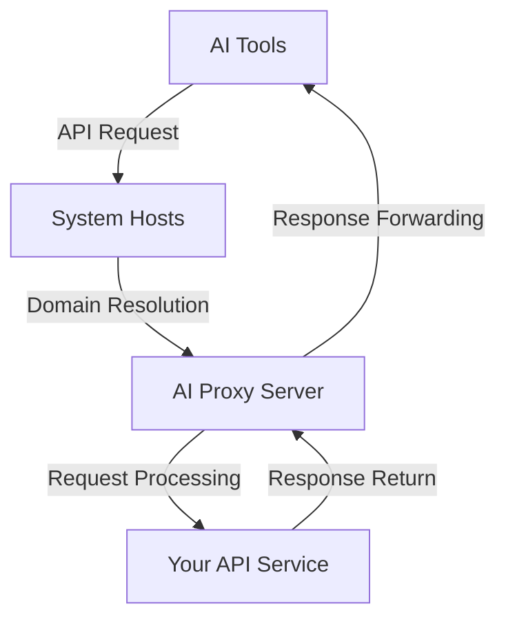

# AI Proxy

An AI proxy program based on hosts file modification and built-in HTTPS server

## Introduction

AI Proxy is a lightweight proxy tool designed to solve AI tools' access restrictions to private models. By modifying system hosts files and providing a built-in HTTPS server, it can redirect AI tools' API requests to your own OpenAI API or other compatible API services.

## Features

- 🔄 **API Redirection**: Redirect AI tools' API requests to your own API service
- 🔒 **HTTPS Support**: Built-in HTTPS server for secure API communication
- 🛠️ **Cross-Platform Support**: Supports Windows and Linux systems
- ⚙️ **Flexible Configuration**: Configurable proxy host lists and API parameters
- 🔄 **Model Switching**: Allows you to switch AI tools' models to better or more economical options

## How It Works



1. AI tools initiate API requests to standard endpoints (e.g., api.openai.com)
2. System hosts file resolves domain names to the local AI Proxy server
3. AI Proxy receives the request, processes it, and forwards it to your configured API service
4. API response returns through AI Proxy back to the AI tools

## Quick Start

### Install Dependencies

```bash
pip install -r requirements.txt
```

### Configuration

Edit the `config.json` file to set your API key and target service:

```json
{
  "proxy": {
    "hosts": ["api.openai.com"]
  },
  "openai": {
    "api_key": "your-api-key-here",
    "base_url": "https://api.openai.com/v1",
    "models": ["gpt-3.5-turbo"]
  }
}
```

### Run

```bash
python main.py
```

## Configuration Guide

### Proxy Configuration

- `hosts`: List of domains to proxy
- Default includes `api.openai.com`

### OpenAI Configuration

- `api_key`: Your OpenAI API key
- `base_url`: API base address (supports OpenAI-compatible APIs)
- `models`: List of supported models

## Technical Architecture

- **Language**: Python 3.8+
- **Server**: Standard library-based HTTPS server
- **Certificate**: Automatic SSL certificate generation and installation
- **Platform**: Windows / Linux cross-platform support

## Important Notes

- Administrator privileges required for first run to modify hosts file
- Ensure firewall allows local HTTPS connections
- Configure correct API keys and endpoint addresses
