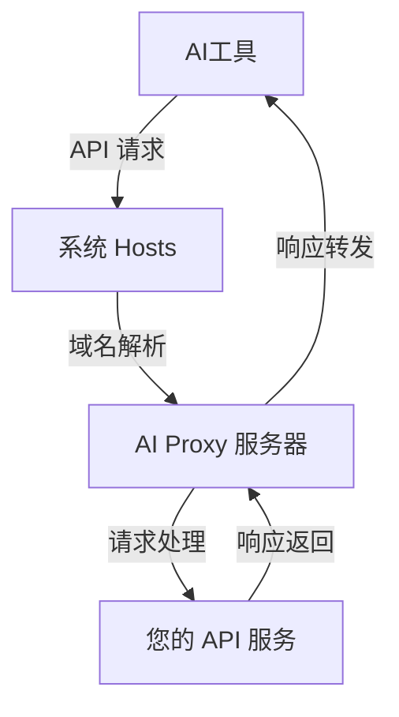

# AI Proxy
[English](https://github.com/FranJ2/ai-proxy/blob/main/README.md) | [简体中文](https://github.com/FranJ2/ai-proxy/blob/main/README_CN.md)

一个基于 hosts 文件修改和内建 HTTPS 服务器的 AI 代理程序

## 简介

AI Proxy 是一个轻量级的代理工具，用于解决 AI 工具对私有模型访问的限制问题。通过修改系统 hosts 文件和内置 HTTPS 服务器，它能够将 AI 工具的 API 请求重定向到您自己的 OpenAI API 或其他兼容的 API 服务。

## 功能特性

- 🔄 **API 重定向**: 将 AI 工具的 API 请求重定向到您自己的 API 服务
- 🔒 **HTTPS 支持**: 内置 HTTPS 服务器，支持安全的 API 通信
- 🛠️ **跨平台支持**: 支持 Windows 和 Linux 系统
- ⚙️ **灵活配置**: 可配置代理的主机列表和 API 参数
- 🔄 **模型切换**: 允许您切换 AI 工具使用的模型到更优或更经济的选项

## 工作原理



1. AI 工具发起 API 请求到标准端点（如 api.openai.com）
2. 系统 hosts 文件将域名解析到本地 AI Proxy 服务器
3. AI Proxy 接收请求，处理后转发到您配置的 API 服务
4. API 响应通过 AI Proxy 返回给 AI 工具

## 快速开始

### 安装依赖

```bash
pip install -r requirements.txt
```

### 配置

编辑 `config.json` 文件，设置您的 API 密钥和目标服务：

```json
{
  "proxy": {
    "hosts": ["api.openai.com"]
  },
  "openai": {
    "api_key": "your-api-key-here",
    "base_url": "https://api.openai.com/v1",
    "models": ["gpt-3.5-turbo"]
  }
}
```

### 运行

```bash
python main.py
```

## 配置说明

### 代理配置

- `hosts`: 需要代理的域名列表
- 默认包含 `api.openai.com`

### OpenAI 配置

- `api_key`: 您的 OpenAI API 密钥
- `base_url`: API 基础地址（支持 OpenAI 兼容的 API）
- `models`: 支持的模型列表

## 技术架构

- **语言**: Python 3.8+
- **服务器**: 基于标准库的 HTTPS 服务器
- **证书**: 自动生成和安装 SSL 证书
- **平台**: Windows / Linux 跨平台支持

## 注意事项

- 首次运行需要管理员权限来修改 hosts 文件
- 确保防火墙允许本地 HTTPS 连接
- 配置正确的 API 密钥和端点地址
